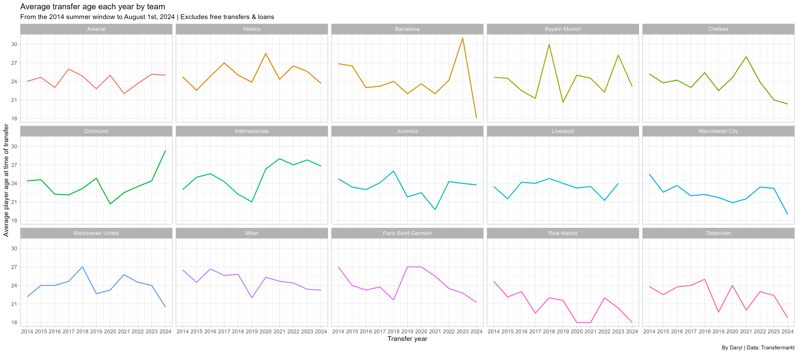
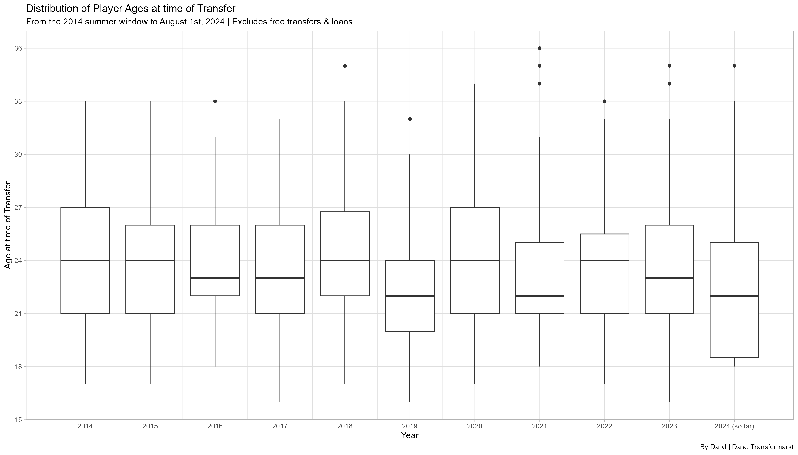
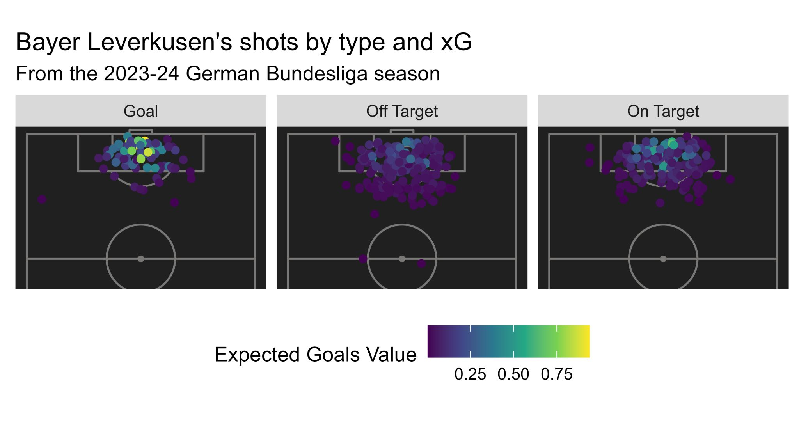
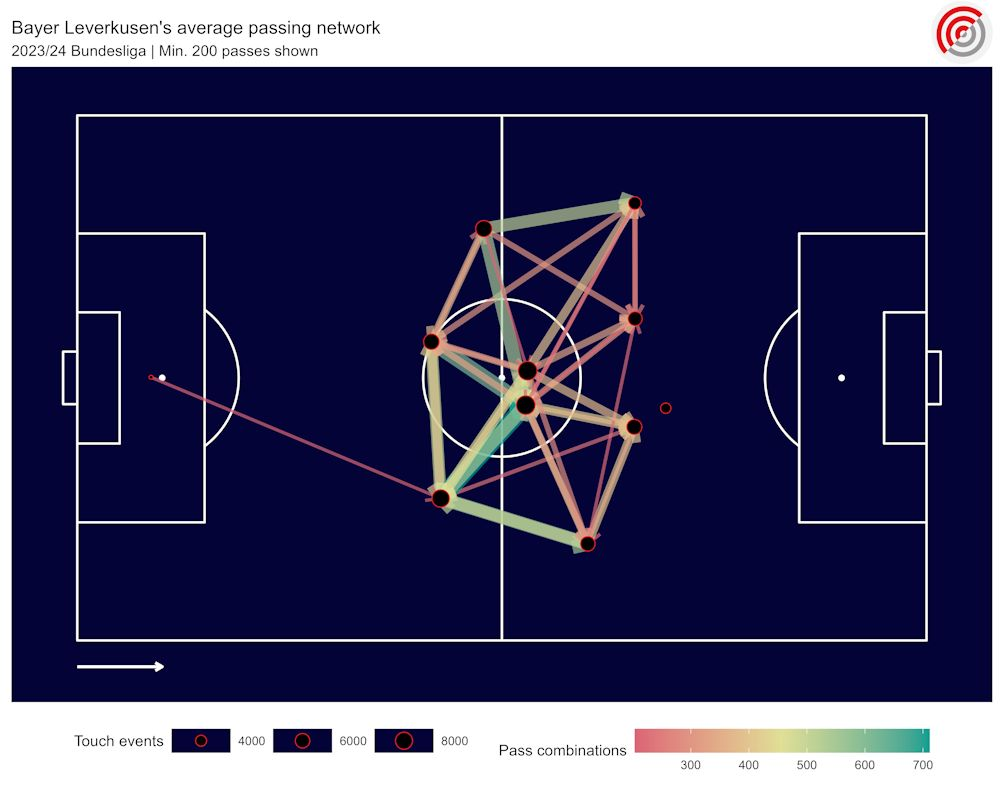

# Football Analytics codes

A place where I store all of my codes to create vizzes

## Includes

- NPxG per game, viz inspired by StatsBomb's original viz
  .png>)

- PSxG overperformance by shot angles
  .png>)

- Pizzas and radars for scouting players
  .png>)

- Player dashboard
  .png>)

- Line plot faceted by team, in R
  

- Box and whisker plot, in R
  

- Bayer Leverkusen related vizzes, using data from Statsbomb
  
  
